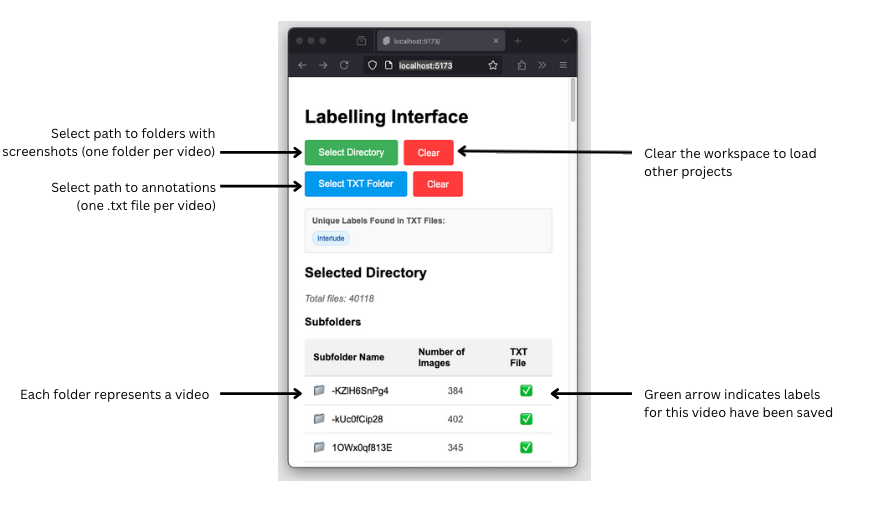

# Temporal Action Segmentation Labeling Interface

This is a simple Svelte-based labeling tool designed for creating ground truth datasets for **temporal action segmentation** tasks. It provides an interactive timeline where you can label and adjust action segments easily.

---

## 📂 Project Structure

| File            | Purpose                                                                 |
|-----------------|-------------------------------------------------------------------------|
| `+page.svelte`  | **Main UI** — The interactive labeling interface with timeline controls. |
| `index.ts`      | **App Entry** — Mounts the Svelte app in the browser.                    |
| `app.d.ts`      | **TypeScript Types** — Provides types for better developer experience.  |
| `app.html`      | **HTML Template** — Base HTML structure to load the app.                 |
| `README.md`     | **Project Guide** — You're reading it.                                   |

---

## ✨ Features

✅ Visualize and label temporal segments  
✅ Click and drag to create segments  
✅ Adjust or delete existing labels  
✅ (Planned) Export labeled data for model training  
✅ Clean and simple interface for rapid annotation  

---

## 🚀 Getting Started

### 1. Install Dependencies
```bash
npm install
```

### 2. Run the Development Server
```bash
npm run dev
```
Access the app at:  
```
http://localhost:5173/
```
Or open it automatically:
```bash
npm run dev -- --open
```

---

## 🏗 Building for Production
```bash
npm run build
npm run preview
```

---

## 🖥 Usage Overview

### Initial Setup

1. Select Directory: Click the "Select Directory" button to choose the folder containing your video screenshots (each video is represented by its own folder).
2. Select TXT Folder: Click the "Select TXT Folder" button to specify where the annotation files should be stored (one .txt file per video).


### Main Interface Navigation

1. Directory Overview: After selecting a directory, you'll see:
- Total files count (e.g., 40118 shown in the example)
- List of subfolders, each representing a video
- Number of images in each subfolder
- Green checkmarks indicating which videos already have saved labels

2. Video Navigation: When viewing a specific video (subfolder):
- Use "Main" button to return to the directory overview
- Use "Previous Video" and "Next Video" buttons to move between videos
- The current subfolder name is displayed (e.g., "-kUc0fCip28")

### Labeling Process

1. Import or Create Labels:
- If a TXT file is available for the current video, you can click "Import Labels"
- Alternatively, create new labels by typing in the "Enter label name" field and clicking "Add Label"

2. Apply Labels to Images:
- Click on a label (e.g., "Interlude") to activate it
- Click on the video frames/images you want to apply this label to Images with labels appear with a red border and the label name beneath them

3. Save Your Work:
- Click "Save Labels to TXT" to store your annotations in the specified text file

The TXT File Analysis section shows statistics about your labels (e.g., 60.2% of frames labeled as "Interlude")

## Additional Features

- Click "Clear" buttons to reset your workspace when needed
- The interface shows unique labels found in TXT files
- A color picker is available when creating new labels

This workflow allows you to efficiently label frames across multiple videos and save that information in a structured format for further analysis.


---

## 🙏 Acknowledgments
Built with [SvelteKit](https://kit.svelte.dev/) ❤️